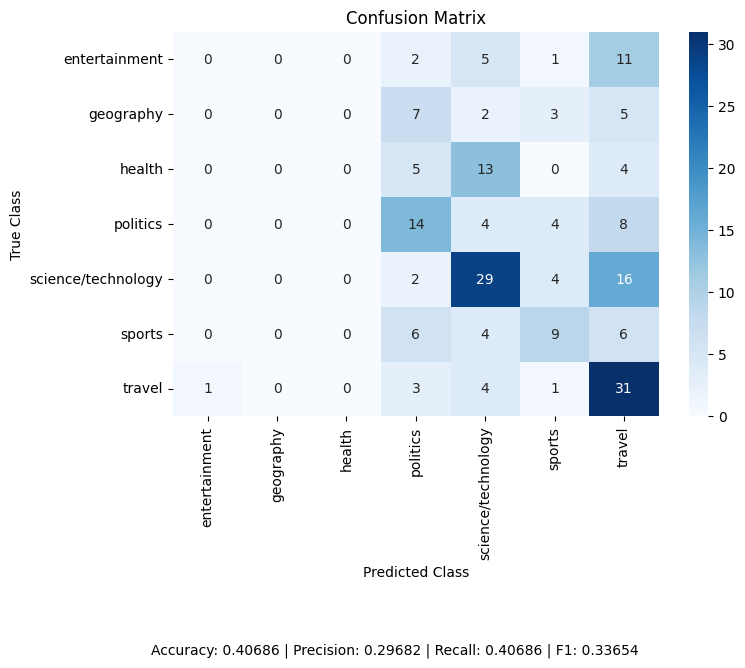

# Assignment-3-neural-topic-classification-for-Simplified-Chinese

### How to run the scripts

1. Train FastText/word embeddings

```bash
python word_embeddings.py --filenames Data/train.tsv Data/dev.tsv Data/test.tsv --dimensionsize 300 --output ft.model
```

2. Create sentence embeddings

```bash
python sentence_embeddings.py --input Data/train.tsv --model ft.model --output train_embeddings.npz
python sentence_embeddings.py --input Data/test.tsv --model ft.model --output test_embeddings.npz
```

3. Train the classifier

```bash
python train_model.py --data train_embeddings.npz --epochs 10 --batchsize 32 --output classifier.pt
```
  
4. Evaluate the model

```bash
python evaluate.py --data test_embeddings.npz --model classifier.pt
```

### Transcript of a full session

```bash
gusalgfa@GU.GU.SE@mltgpu:~$ cd ML_lab_3
gusalgfa@GU.GU.SE@mltgpu:~/ML_lab_3$ python word_embeddings.py --filenames Data/train.tsv Data/dev.tsv Data/test.tsv --dimensionsize 300 --output ft.model
Working...
FastText model saved to ft.model
gusalgfa@GU.GU.SE@mltgpu:~/ML_lab_3$ python sentence_embeddings.py --input Data/train.tsv --model ft.model --output train_embeddings.npz
Working...
Saved embeddings to train_embeddings.npz
gusalgfa@GU.GU.SE@mltgpu:~/ML_lab_3$ python sentence_embeddings.py --input Data/test.tsv --model ft.model --output test_embeddings.npz
Working...
Saved embeddings to test_embeddings.npz
gusalgfa@GU.GU.SE@mltgpu:~/ML_lab_3$ python train_model.py --data train_embeddings.npz --epochs 10 --batchsize 32 --output classifier.pt
Working...
Epoch 1, Loss: 41.2304
Epoch 2, Loss: 39.1644
Epoch 3, Loss: 38.0279
Epoch 4, Loss: 37.6694
Epoch 5, Loss: 37.3968
Epoch 6, Loss: 36.9767
Epoch 7, Loss: 36.3768
Epoch 8, Loss: 36.4697
Epoch 9, Loss: 35.7029
Epoch 10, Loss: 35.2754
Model saved as classifier.pt
gusalgfa@GU.GU.SE@mltgpu:~/ML_lab_3$ python evaluate.py --data test_embeddings.npz --model classifier.pt
Working...

Evaluation Results:
Accuracy:  0.40686
Precision: 0.29682
Recall:    0.40686
F1-score:  0.33654

Confusion Matrix:
                    entertainment  geography  health  politics  science/technology  sports  travel
entertainment                   0          0       0         2                   5       1      11
geography                       0          0       0         7                   2       3       5
health                          0          0       0         5                  13       0       4
politics                        0          0       0        14                   4       4       8
science/technology              0          0       0         2                  29       4      16
sports                          0          0       0         6                   4       9       6
travel                          1          0       0         3                   4       1      31

Heatmap also saved as confusion_matrix.png
gusalgfa@GU.GU.SE@mltgpu:~/ML_lab_3$ 
```
<a href="confusion_matrix.png">
  
</a>

### Concise observations
* Overall accuracy (0.41) is above chance (~0.14 for 7 classes), so the model is learning something.
* Some categories like travel are predicted more accurately than others.
* The model fails to correctly predict the classes entertainment, geography, and health, and rarely predicts any instances as belonging to these classes.
* The model tends to over-predict the classes politics, science/technology, sports, and travel.
* Precision is lower than recall, indicating the model over-predicts some classes.

### Latin characters
Latin characters are not handled differently from Chinese characters but may affect model performance.
    